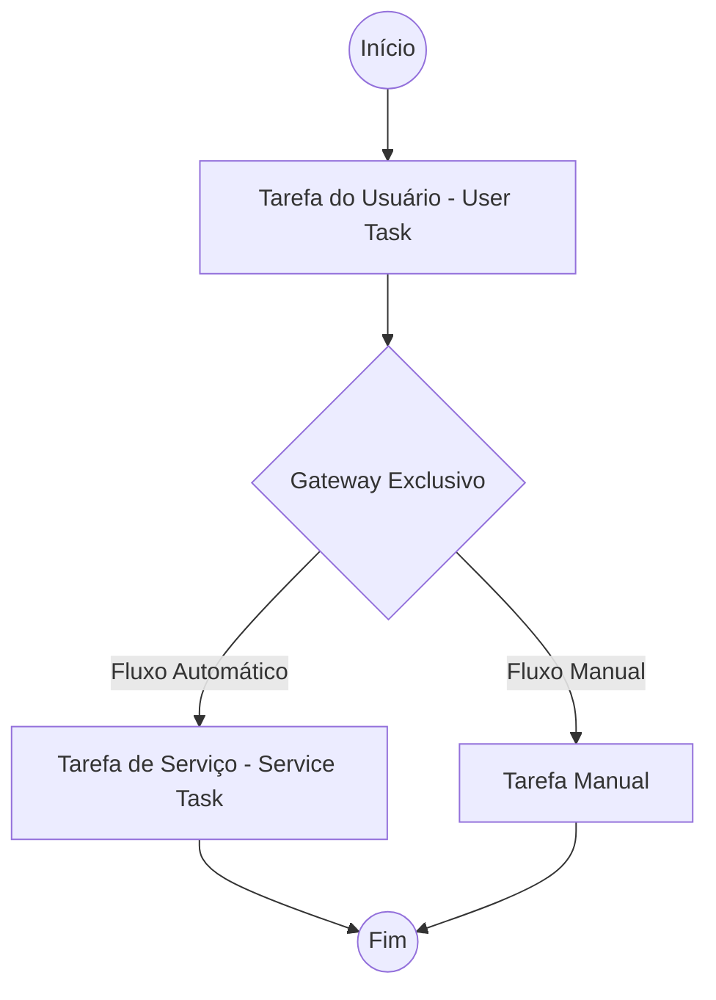

# BPMN_RULES - Regras de Modelagem BPMN e Governança de Workflows

> **Contexto de Regras BPMN e Processos para Desenvolvimento Assistido por IA**
> Este documento normatiza as regras de mapeamento de diagramas de processos de negócio na HIT Operations Platform. O Canvas interativo, os serializadores e os analisadores de IA devem impor a integridade sintática e semântica estipulada nesta norma.

---

## 1. Diretrizes de Modelagem BPMN 2.0 na HIT
A modelagem de processos na **HIT Governance Platform** segue o padrão internacional da notação **BPMN 2.0** (*Business Process Model and Notation*), estritamente adaptada para permitir a execução automatizada, análise de gargalos por IA e auditorias estruturadas. 

Os processos de negócio devem ser classificados de forma clara entre a situação operacional corrente (**AS IS**) e a visão otimizada de destino (**TO BE**), oferecendo rastreabilidade histórica completa para as tomadas de decisão da diretoria executiva.

---

## 2. Componentes e Elementos Suportados no Canvas 2.0

Para garantir a simplicidade na edição por líderes operacionais e a integridade sintática na leitura das ferramentas de IA, o Canvas Interativo suporta uma seleção estratégica de símbolos BPMN:

### A. Elementos de Fluxo e Notações Adotadas
*   **Start Event (Evento de Início)**: Representado por círculo simples verde em HSL. Indica o gatilho desencadeador do processo (ex: "Recebimento de Nota Fiscal SAP").
*   **User Task (Tarefa de Usuário)**: Caixa retangular com ícone de operador. Indica atividades manuais executadas por colaboradores nas plataformas corporativas (ex: "Validar Assinatura do Contrato").
*   **Service Task (Tarefa de Serviço)**: Caixa retangular com engrenagem. Representa integrações diretas via API ou processamentos automatizados em background (ex: "Consulta de Background Check / KYC via API").
*   **Exclusive Gateway (Decisão - XOR)**: Losango com X centralizador. Roteia o fluxo com base em condições lógicas excludentes.
*   **Parallel Gateway (Bifurcação - AND)**: Losango com sinal de +. Usado para sincronizar tarefas paralelas sem dependência direta de conclusão imediata.
*   **Boundary Event (Evento de Fronteira)**: Círculo duplo conectado ao limite de uma tarefa. Utilizado principalmente para tratamento de erros e expiração de timeouts de SLAs de execução de API.
*   **End Event (Evento de Fim)**: Círculo espesso vermelho em HSL. Indica a conclusão definitiva do fluxo corporativo.

---

## 3. Convenções de Nomenclatura (*Naming Conventions*)
Para assegurar a legibilidade e a inteligibilidade do modelo de dados por sistemas externos de IA, todas as entidades inseridas no Canvas devem obedecer à padronização:

*   **Identificação de Processos**: Nomes curtos, substantivos, em caixa alta e sem caracteres especiais para chaves de identificação (ex: `PRC_SAP_BILLING`, `PRC_KYC_ONBOARDING`).
*   **Eventos de Início (Start Events)**: Devem expressar um estado completado que sirva de gatilho, utilizando a fórmula *Substantivo + Particípio* (ex: "Contrato recebido", "Nota fiscal emitida").
*   **Tarefas de Usuário e Serviço (Tasks)**: Devem iniciar obrigatoriamente com um *Verbo de Ação no Infinitivo + Objeto Direto* (ex: "Validar certidão cadastral", "Emitir chave no SAP", "Consultar API de KYC").
*   **Gateways Exclusivos**: Devem ser nomeados como uma *Pergunta Clara* com saídas rotuladas correspondendo a respostas booleanas (ex: "Aprovado?", com caminhos "Sim" e "Não").

---

## 4. Integração Automática com Organograma e Raias (*Swimlane Rules*)
Para quebrar silos departamentais e garantir que cada atividade de negócio possua um responsável direto, o Canvas de Modelagem implementa o conceito de **Raias Inteligentes** amarradas em tempo real ao banco de dados:

*   **Sincronização com Tabela de Setores**: Ao arrastar uma tarefa ou criar uma raia (`Lane`), o Canvas consulta o catálogo de setores cadastrados via Prisma (`Sector`). O modelador deve selecionar um setor corporativo real da HIT (ex: Faturamento SAP, Customer Success, Compliance).
*   **Vinculação de Lideranças**: Cada raia mapeada puxa automaticamente o cargo e a identificação do líder do setor (ex: "Responsável: WL Lead Ops"). Isso impede a criação de tarefas sem donos reais e simplifica as auditorias de responsabilidades em incidentes de atraso de SLA.
*   **Mapeamento de Transições**: O sistema calcula automaticamente atritos operacionais e latência no momento de transferência de tarefas entre raias diferentes (ex: tarefa migrando de *Compliance* para *Faturamento*).

---

## 5. Regras de Validação Sintática e Regras de Negócio
O motor de validação embutido no Canvas analisa os diagramas em tempo real. Erros críticos e avisos de melhoria impedem a promoção do fluxo da fase "Rascunho" para "Ativo".

### A. Regras Críticas (Erros impeditivos de publicação)
1.  **Unicidade de Início**: Cada processo deve conter exatamente um **Start Event**.
2.  **Conectividade de Fluxo**: Nenhum elemento pode ficar isolado (órfão) no Canvas. Todas as tarefas e gateways devem possuir ao menos uma linha de fluxo de entrada e uma de saída de dados.
3.  **Escapes de Deadlock**: Gateways exclusivos devem possuir condições lógicas claras de saída e um caminho padrão de fallback (*default flow*) mapeado para prevenir loops infinitos em processamento automatizado.
4.  **Resoluções de Fim**: O processo deve terminar obrigatoriamente em pelo menos um **End Event**.

### B. Regras de Boas Práticas (Alertas de Melhoria)
*   **Limite de Complexidade**: Processos com mais de 15 elementos visuais geram um alerta de refatoração, recomendando a divisão em sub-processos estruturados para facilitar a interpretação por parte dos analistas.
*   **Service Task Sem Tratar Erro**: Toda tarefa de serviço conectada a uma API de terceiros deve conter um *Boundary Event* de tratamento de erro ou tempo limite cadastrado, evitando falhas silenciosas de integração.

---

## 6. Serialização, Persistência e Estrutura XML/JSON (*Workflow Structure*)
Para otimizar o transporte de informações e permitir o versionamento do histórico de processos, o Canvas adota um fluxo duplo de persistência:

*   **Formato de Modelagem JSON**: O Canvas converte o layout geométrico, posições X/Y dos elementos e conexões de fluxo em um esquema JSON proprietário compacto de alta fidelidade para renderização instantânea do editor.
*   **Exportação XML BPMN 2.0**: O motor converte dinamicamente o modelo JSON em XML padrão de conformidade BPMN 2.0, permitindo importação e exportação para outros ecossistemas corporativos de mercado (ex: Camunda, Bizagi).
*   **Versionamento e Rastreamento**: Cada alteração de fluxo salva gera um incremento de versão (`v1.0.0` $\rightarrow$ `v1.0.1`) no banco de dados e adiciona uma linha histórica na tabela `ProcessVersion`, permitindo reverter para versões anteriores com um clique.
