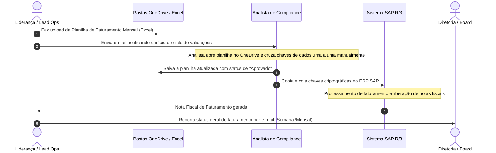

# IMPLEMENTATION_CONNECTIVITY_AS_IS - Diagnóstico Operacional do Fluxo Atual

> **Contexto de Análise Operacional AS IS para Desenvolvimento Assistido por IA**
> Este documento apresenta o diagnóstico detalhado e o mapeamento de fluxo da arquitetura de integração manual corrente ("AS IS"). IAs devem ler este arquivo para identificar vulnerabilidades de processos que precisam ser modeladas e resolvidas nos diagramas de transição "TO BE".

---

## 1. Visão Geral do Fluxo "AS IS" Atual (Manual & OneDrive)
Atualmente, a conciliação financeira de faturamento corporativo e a validação cadastral (KYC) de contas Enterprise na HIT operam por meio de um processo informal de troca de dados baseado em planilhas estáticas no Microsoft OneDrive, e-mails departamentais e inserção de dados manual em sistemas corporativos internos (SAP). 

Esse fluxo gera atritos de comunicação, falta de rastreabilidade histórica de modificações e alto risco de violação de Acordos de Nível de Serviço (SLA) contratuais.

---

## 2. Diagnóstico de Gargalos e Pontos de Atrito (*Bottlenecks & Pain Points*)

### A. O gargalo da Conciliação Manual do Excel
*   **Descrição**: O cruzamento de dados de contratos de clientes com chaves de validação financeira é feito manualmente abrindo-se planilhas gigantescas no OneDrive.
*   **Frequência de Falhas**: Elevada. A formatação de valores e nomes de empresas varia constantemente, exigindo intervenções de correção humana ad-hoc.
*   **Impacto de SLA**: O processo manual consome em média **72 horas úteis**, representando um gargalo crítico que atrasa a emissão das notas fiscais e afeta o fluxo de caixa corporativo da HIT.

### B. Falta de Rastreabilidade e Logs de Auditoria
*   **Descrição**: Não há log persistente de quem modificou uma linha da planilha no OneDrive ou o motivo de um contrato ter sido marcado como pendente de conciliação.
*   **Impacto de Riscos**: Em auditorias de conformidade legal, a HIT não consegue comprovar o fluxo de controle de mudanças, deixando a infraestrutura exposta a riscos de segurança corporativa e falhas regulatórias.

### C. Atraso Crítico em Validações KYC (Onboarding Latency)
*   **Descrição**: O analista de compliance valida as certidões cadastrais e de segurança dos clientes de forma descentralizada. Os documentos chegam por e-mail e são salvos aleatoriamente em pastas no OneDrive.
*   **Impacto no CS**: O onboarding de clientes Enterprise, que deveria levar no máximo 48 horas, estende-se frequentemente para **5 a 7 dias úteis**, gerando desgaste inicial de relacionamento com o parceiro.

---

## 3. Matriz de Diagnóstico de Riscos e Incidentes (*Risks & SLA Issues*)

| ID do Risco | Categoria do Impacto | Severidade Operacional | Descrição do Risco Operacional | Ação de Mitigação Exigida no TO BE |
| :--- | :--- | :--- | :--- | :--- |
| **RISK-01** | Vazamento de SLA | **Crítica** | Estouro na janela de 72 horas para faturamento devido a ausência de operadores por férias ou sobrecarga de planilhas. | Automação via Service Task conectada diretamente às APIs de faturamento e SAP. |
| **RISK-02** | Segurança de Dados | **Alta** | Credenciais corporativas de acesso ao ERP SAP compartilhadas informalmente via e-mail e chats para acelerar o processo manual. | Integração de autenticação baseada no Supabase e controle de acessos RBAC estrito. |
| **RISK-03** | Erro Cadastral | **Média** | Digitação incorreta de chaves criptográficas de notas fiscais gerando retrabalho no faturamento mensal. | Validação sintática programática de campos antes do envio dos metadados. |
| **RISK-04** | Perda Histórica | **Alta** | Atas de reuniões de análise de gargalos operacionais dispersas em arquivos locais sem acompanhamento ativo. | Módulo de atas estruturadas integrado ao GPT/Llama com geração automática de TODOs. |

---

## 4. O Caminho para a Redução de Atrito (Visão TO BE)
O diagnóstico operacional aponta que a estabilização das operações da HIT exige a eliminação completa do Excel compartilhado como barramento de integração de processos. A transição para a **HIT Operations Platform** visa:
*   Substituir a troca manual de planilhas por inserções dinâmicas monitoradas no banco de dados.
*   Automatizar as Service Tasks de background check através de conectores de API.
*   Garantir visibilidade em tempo real para a diretoria através de indicadores de SLA automatizados, substituindo o report estático manual por e-mail.
