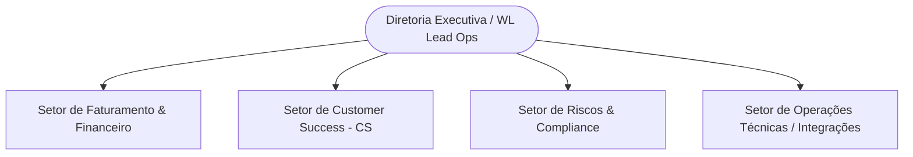

# OPERATIONS_CONTEXT - Estrutura Operacional e Desafios de Governança

> **Contexto de Operações e Negócio para Desenvolvimento Assistido por IA**
> Este documento mapeia a realidade operacional interna da HIT, detalhando as estruturas de departamentos, fluxos de trabalho e barreiras processuais. Desenvolvedores e agentes inteligentes devem utilizar estas dores e estruturas como base de dados para testes de alta fidelidade e cenários de IA.

---

## 1. Estrutura de Departamentos e Organograma da HIT
As operações de backoffice e atendimento B2B da HIT estão segmentadas em quatro grandes áreas funcionais amarradas à governança:

### A. Setor de Faturamento e Financeiro
*   **Escopo**: Responsável pela conciliação de contratos B2B de grandes contas, emissão de faturamento mensal e interface direta com o ERP corporativo **SAP R/3**.
*   **Liderança**: Gerência de Backoffice Financeiro.
*   **Gargalo Crítico**: Processamento manual de relatórios gerados fora do SAP que chegam via planilhas de e-mail.

### B. Setor de Customer Success (CS)
*   **Escopo**: Gerenciamento de relacionamento pós-venda com clientes Enterprise, monitorando a satisfação, atritos de integração técnica e entrega física de SLAs contratados.
*   **Liderança**: Coordenação de Contas Estratégicas.
*   **Gargalo Crítico**: Falta de uma tela unificada de alertas preventivos de SLAs estourados de integração, descobrindo violações apenas no fechamento do trimestre (*post-mortem*).

### C. Setor de Riscos, Compliance e Jurídico
*   **Escopo**: Validação cadastral regulatória (KYC - *Know Your Customer*), auditorias de conformidade com chaves criptográficas corporativas e segurança de dados de terceiros.
*   **Liderança**: Comitê de Governança e Compliance.
*   **Gargalo Crítico**: Atas de reuniões de comitê registradas informalmente em arquivos locais do Word, gerando perda histórica de planos de mitigação ativa de riscos.

### D. Setor de Operações Técnicas e Integrações
*   **Escopo**: Monitoramento de barramentos de API e integridade de conexões físicas de dados entre os clientes corporativos e a infraestrutura da HIT.
*   **Liderança**: Coordenação de Infraestrutura e Integração.

---

## 2. Desafios Operacionais Detalhados (*Operational Challenges*)

### A. O Estrangulamento do Faturamento SAP (SAP Billing Latency)
O principal ralo de eficiência da HIT reside no fluxo de conciliação financeira de contratos. O processo "AS IS" atual requer que um analista sênior do financeiro baixe manualmente os logs de faturamento, cruze-os com planilhas Excel armazenadas no OneDrive e insira cada chave de liberação manualmente no SAP.
*   **Latência Média**: 72 horas por ciclo de faturamento.
*   **Risco**: Perda financeira por atrasos na conciliação e alta taxa de erro humano nos lançamentos de chaves de faturamento.

### B. A Fragmentação do Onboarding e KYC (Onboarding Friction)
A entrada de uma nova conta Enterprise exige um background check de segurança cadastral e conformidade legal (KYC) antes do início das integrações técnicas. Atualmente, esse fluxo trafega de forma caótica entre e-mails, pastas do SharePoint e validações de PDFs feitas individualmente pelos analistas de compliance.
*   **Latência Média**: 5 a 7 dias úteis.
*   **Risco**: Estouro do SLA contratual de início do projeto com o cliente parceiro, gerando atrito de CS logo no primeiro dia de relacionamento corporativo.

---

## 3. Metas de Transformação e Necessidades de Governança (*Governance Needs*)
Para que a HIT atinja a excelência de controle exigida pela diretoria executiva, a plataforma de Governança deve responder a três necessidades imediatas de controle de processos:

1.  **Auditoria Automatizada**: Substituir o controle informal por logs digitais centralizados via tabelas PostgreSQL (`AuditLog`), permitindo que a IA aponte o momento exato em que uma tarefa excedeu a latência recomendada.
2.  **Mitigação de Riscos de Ponta a Ponta**: Impedir que qualquer fluxo BPMN seja desenhado no Canvas sem a amarração a uma matriz de severidade ativa e plano de contingência aprovado.
3.  **Transição Sistêmica de Modelos**: Garantir que as lideranças operacionais possuam uma visualização gráfica imediata do progresso de transição entre o estado caótico anterior (**AS IS**) e a eficiência simplificada projetada para as futuras execuções automáticas (**TO BE**).
