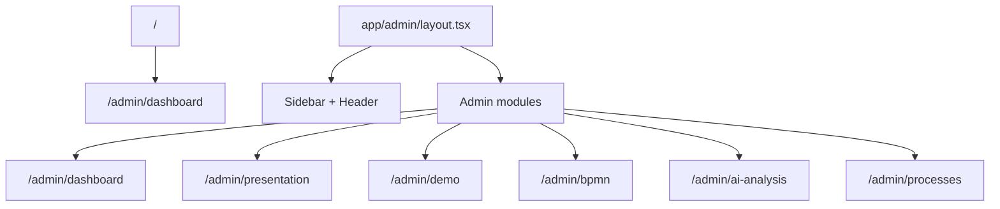

# HIT Operations Platform - System Architecture

This document describes the current enterprise architecture of the HIT Operations Platform after the executive dashboard, presentation mode, enterprise mock data and leadership demo environment were added.

## 1. Application Shape

The platform uses Next.js App Router with a domain-oriented admin surface under `app/admin`.



## 2. Folder Responsibilities

| Folder | Responsibility |
| --- | --- |
| `app/admin/*` | Route entry points and route-specific client containers. |
| `components/dashboard` | Executive cockpit widgets and shared admin chrome currently used by dashboard/admin shell. |
| `components/presentation` | Fullscreen leadership storytelling components. |
| `components/bpmn` | BPMN canvas, nodes, inspector, toolbar, comparison and analytics overlays. |
| `components/ai` | AI analysis panels, transcript workflow, recommendations and operational health views. |
| `components/process` | Process inventory cards, table, maturity, risks, dependencies and timeline. |
| `config/navigation.ts` | Single source of truth for sidebar groups, route labels and breadcrumb naming. |
| `lib/*-data.ts` | Enterprise demo data, dashboard aggregates, presentation storyline and leadership demo narrative. |
| `lib/sparkline.ts` | Shared lightweight SVG sparkline path generation. |
| `lib/supabase` and `lib/prisma.ts` | Future backend integration helpers. |

## 3. Routing Conventions

- `/` redirects to `/admin/dashboard`.
- `/admin` redirects to `/admin/dashboard`.
- `/admin/presentation` is a chrome-free route inside the admin layout for fullscreen leadership storytelling.
- `/admin/demo` is the presenter command center with the demo script, talking points, wow moments and safe-mode checklist.
- Route names and sidebar definitions must be updated in `config/navigation.ts`, not inside individual chrome components.

## 4. Component Organization

The project uses domain components instead of one large global component bucket. This is intentional:

- Dashboard widgets can be dense and metric-driven.
- Presentation widgets can be cinematic and slide-oriented.
- BPMN widgets can own canvas-specific concerns.
- AI widgets can own transcript and recommendation workflows.

Cross-domain logic should move to `lib` or `config` only when the same behavior appears in multiple places. Current examples:

- Navigation data: `config/navigation.ts`
- Sparkline path generation: `lib/sparkline.ts`
- Enterprise operational data: `lib/enterprise-operational-data.ts`

## 5. State Management

State is intentionally local for now:

- Admin shell state: sidebar collapsed state in `app/admin/layout.tsx`.
- Dashboard state: active dashboard tab in `DashboardClient.tsx`.
- Presentation state: active slide, autoplay, screenshot mode, summary mode and chrome visibility in `PresentationClient.tsx`.

This is appropriate because there is no cross-route mutable business state yet. Introduce global state only when multiple route trees need to mutate the same live operational model.

## 6. Data Architecture

The current dataset is presentation-grade and centralized enough for demo stability:

- `lib/enterprise-operational-data.ts`: process, KPI, customer, org, BPMN, AI insight and roadmap data.
- `lib/dashboard-data.ts`: dashboard-specific aggregates and KPI cards.
- `lib/presentation-data.ts`: slide storyline, AS IS/TO BE flows and presentation visuals.
- `lib/demo-flow-data.ts`: final leadership demo flow, talking points, script and recommendations.

Future live integrations should keep this layering:

1. Raw operational sources or APIs.
2. Normalized domain data.
3. View-model aggregates per experience.
4. UI components consuming view models.

## 7. Known Stabilization Notes

- Several legacy/generated components still contain unused imports and variables. They are lint warnings only and do not block `next build`.
- `components/dashboard/Header.tsx` and `Sidebar.tsx` remain in `components/dashboard` for compatibility, but they now consume shared navigation config. If the shell grows, move them to `components/layout` in a dedicated migration.
- Similar names such as `RiskMatrix` and `BottleneckHeatmap` exist in multiple domains. They are not currently duplicates; they serve different presentation contexts. Extract shared primitives only if behavior converges.

## 8. Validation Commands

Use these commands after architecture changes:

```bash
npm run lint
npm run build
```
