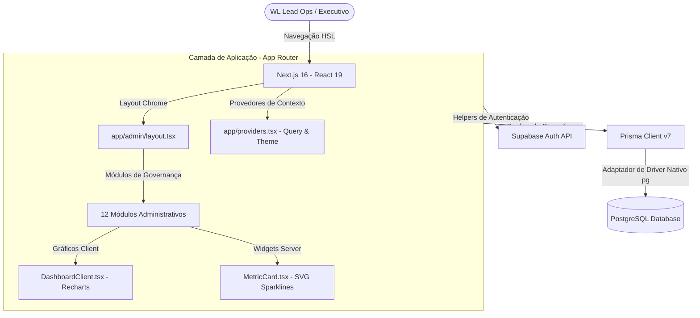

# SYSTEM_ARCHITECTURE - Arquitetura de Sistemas e Engenharia

> **Contexto Técnico e de Engenharia para Desenvolvimento Assistido por IA**
> Este documento define a infraestrutura, a pilha tecnológica e as diretrizes de desenvolvimento técnico da HIT Operations Platform. Alterações na arquitetura de rotas do Next.js 16, no pool de conexões Prisma 7 ou na autenticação Supabase devem obedecer estritamente às normas aqui fixadas para manter a estabilidade produtiva do sistema.

---

## 1. Visão Geral da Arquitetura
A plataforma foi arquitetada como uma aplicação web robusta de alta fidelidade e tipo-seguro (*type-safe*). A pilha é focada em desempenho extremo de renderização, isolamento de escopo de microsserviços e segurança corporativa.

---

## 2. Arquitetura Frontend
O frontend é construído sobre o framework **Next.js 16 (React 19)**, aproveitando os recursos modernos do App Router para otimização de renderização e divisão de responsabilidades.

*   **Hybrid Rendering (SSR & Server Components)**: Componentes focados em visualização estática ou processamento sem dependências de hooks de cliente (ex: `MetricCard.tsx` que gera sparklines SVG de forma programática) são renderizados inteiramente no lado do servidor. Isso diminui o tamanho do pacote JS enviado ao navegador e elimina a latência de hidratação.
*   **Isolamento Cliente ("use client")**: Painéis interativos avançados que utilizam animações pesadas (Framer Motion) ou renderização de gráficos (Recharts, como o `DashboardClient.tsx`) são marcados estritamente com `"use client"`.
*   **Pre-rendering Híbrido Amigável**: Os contextos e hooks personalizados (ex: `useTheme` em `app/providers.tsx`) oferecem um retorno de fallback seguro (`theme = "light"`) para suportar a compilação de produção (`npm run build`) livre de falhas de renderização estática.

---

## 3. Arquitetura Backend & Estrutura de APIs
O backend da plataforma opera de forma integrada e híbrida no Next.js Serverless e APIs baseadas em eventos no Supabase:

*   **Serverless Edge Actions & Route Handlers**: As chamadas de gravação, manipulação de processos e versionamento BPMN são orquestradas por rotas dinâmicas do App Router (`app/api/`) escritas com tipagem robusta em TypeScript.
*   **Integração Supabase Realtime**: Eventos críticos de violação de SLAs ou novos incidentes operacionais são escutados em tempo real na camada do cliente conectando-se diretamente aos canais do Supabase Realtime via WebSockets.
*   **Agente de IA Integrado**: O módulo de inteligência assistida (`/admin/ai-analysis`) integra conexões de backend com modelos de linguagem de larga escala para analisar atas de reuniões corporativas e metadados estruturados de processos.

---

## 4. Arquitetura do Banco de Dados & Prisma 7
A plataforma adota o banco de dados **PostgreSQL** hospedado na infraestrutura de nuvem, mapeado com segurança de tipos de ponta a ponta pelo **Prisma ORM 7**.

*   **Prisma 7 Configuração Dinâmica**: Seguindo as diretrizes do Prisma 7, as variáveis de conexão de banco de dados (`url` e `directUrl`) são gerenciadas centralizadamente por meio do arquivo `prisma.config.ts`, suportando variáveis de ambiente seguras.
*   **Pool de Conexões Singleton Nativo**: A fim de evitar o estouro de limite de conexões simultâneas durante a escalabilidade horizontal serverless, a plataforma implementa em `lib/prisma.ts` um singleton do pool de conexões utilizando o driver nativo `pg` e o adaptador `@prisma/adapter-pg`.
*   **Fallback no Cliente**: O singleton de conexão Prisma detecta se a importação do cliente ocorre no navegador, gerando um fallback seguro de tratamento de erro para impedir vazamentos de chaves ou credenciais no lado do browser.

---

## 5. Segurança & Autenticação (*Authentication*)
A segurança corporativa é controlada de forma modular e granular em parceria com o **Supabase Auth**:

*   **Helpers Modularizados**: Helpers dedicados em `lib/supabase/client.ts` e `lib/supabase/server.ts` facilitam a verificação de sessões, login SSO empresarial e proteção estrita de rotas administrativas.
*   **Middleware de Segurança**: O middleware intercepta chamadas na rota `/admin` e subpastas, validando a integridade do token JWT de autenticação do usuário. Acesso não autenticado é redirecionado imediatamente para a página de login institucional.

---

## 6. Estratégia de Escalabilidade (*Scalability Strategy*)
*   **Caching Inteligente**: Utilização de estratégias de *Incremental Static Regeneration* (ISR) e revalidação sob demanda (`revalidateTag`) para páginas de POPs e relatórios, eliminando consultas repetitivas de leitura ao banco de dados PostgreSQL.
*   **Processamento Descentralizado de IA**: Chamadas de IA de processamento pesado de arquivos e transcrições de atas são enviadas para rotas com timeout estendido em background, evitando o bloqueio da thread principal da interface do usuário.
