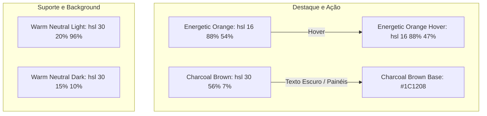

# UI_UX_RULES - Manual de Design System e Regras Estéticas Premium

> **Contexto de Padrões UI/UX e Estilo Visual para Desenvolvimento Assistido por IA**
> Este documento normatiza todas as diretrizes de experiência de usuário (UX), interface (UI) e padrões estéticos do ecossistema HIT. Qualquer nova tela, componente, modal ou fluxo interativo deve ser desenvolvido em estrita conformidade com os tokens e princípios aqui descritos.

---

## 1. Filosofia Estética e Identidade Visual (Warm Corporate)
A **HIT Governance Platform** adota uma identidade visual corporativa premium, moderna e acolhedora. O objetivo do design é projetar sofisticação executiva e autoridade de governança, afastando-se do clichê de interfaces cinzentas e azuladas frias de sistemas administrativos tradicionais. 

A interface adota a estética **Warm Corporate**, construída sobre tons terrosos suaves (Warm Neutrals), contrastes intensos de marrons profundos (Charcoal Brown) e interações dinâmicas energizadas pelo laranja vibrante (Energetic Orange).

---

## 2. Paleta de Cores Corporativa (Especificação HSL)
Todos os elementos do sistema utilizam exclusivamente classes CSS parametrizadas em coordenadas HSL, garantindo flexibilidade total e consistência absoluta no mapeamento de modos Claro e Escuro.

### A. Paleta de Destaques e Ação
*   **Energetic Orange (`hsl(16 88% 54%)`)**: Cor primária oficial para links ativos, botões de ação principal, status em andamento e destaques estritos.
    *   **Hover Dinâmico (`hsl(16 88% 47%)`)**: Usado em efeitos de passagem do mouse (*hover*), gerando um sutil escurecimento térmico.
*   **Charcoal Brown (`hsl(30 56% 7%)`)**: Nosso tom escuro base (`#1C1208`). Empregado para backgrounds de containers escuros, cabeçalhos de alta importância e texto principal no modo claro.

### B. Paleta de Suporte e Fundo (Warm Neutrals)
*   **Warm Neutral Background (`hsl(30 20% 96%)`)**: Off-white com subtonalidade quente, acolhedora ao olhar do executivo. Substitui integralmente os tons de cinza puro (`#F3F4F6` ou `#F9FAFB`).
*   **Soft Warm Slate (`hsl(30 10% 90%)`)**: Linhas de grid, divisores de tabelas e bordas neutras de formulários.
*   **Success Mint (`hsl(142 76% 36%)`)**: Status concluído e SLAs saudáveis.
*   **Danger Red (`hsl(0 84% 60%)`)**: Incidentes críticos, SLAs estourados e ações destrutivas.

---

## 3. Tipografia Corporativa: Anek Latin
A plataforma utiliza a família de fontes **Anek Latin** (via Google Fonts), uma tipografia sem serifa contemporânea de excelente legibilidade em telas de alta densidade e dispositivos móveis.

*   **Escala Tipográfica Recomendada**:
    *   **Título Executivo principal (h1)**: `text-3xl` ou `text-4xl` com peso `font-black` (900) e espaçamento reduzido (`tracking-tight`), conferindo imponência corporativa.
    *   **Títulos de Seção/Cards (h2, h3)**: `text-xl` ou `text-lg` com peso `font-bold` (700) ou `font-semibold` (600).
    *   **Texto de Leitura (Body)**: `text-sm` ou `text-base` com peso `font-normal` (400) ou `font-medium` (500) para legendas.

---

## 4. Padrões de Layout e Comportamento dos Componentes

### A. Sidebar Corporativa Retrátil (*Sidebar Behavior*)
*   **Organização**: Mapeamento unificado dos 12 módulos agregados em 4 categorias lógicas claras (Estratégia, Processos, Governança, Suporte).
*   **Busca em Tempo Real**: Campo de input de busca integrado que filtra dinamicamente no cliente os links das categorias à medida que o usuário digita, exibindo efeitos de transição CSS suaves.
*   **Comportamento de Colapso**: Botão de alternância retrátil. Quando retraída, a sidebar oculta rótulos de texto e categorias, exibindo apenas os ícones em formato compacto (Tooltip descritiva no hover) para aumentar o espaço de trabalho.

### B. Header Glassmórfico com Breadcrumbs
*   **Efeito Visual**: Fundo translúcido com desfoque de movimento (`backdrop-blur-md bg-background/80`) e borda inferior Warm Slate suave.
*   **Breadcrumbs Inteligentes**: Sistema que traduz e mapeia os segmentos da URL para o português corporativo executivo (ex: `/admin/customer-success` $\rightarrow$ `Administração / Sucesso do Cliente`).

### C. Estrutura de Cards de Dashboard (*Card Structure*)
Todos os cartões de informações e widgets operacionais seguem uma volumetria de renderização estrita:
*   Bordas finas com cantos moderados arredondados (`rounded-md` ou `rounded-lg`).
*   Preenchimento interno confortável (`p-6` ou `p-8` no TailwindCSS) para assegurar o respiro visual dos dados.
*   Fundo levemente contrastante de modo de cor (`bg-card/50`) com efeito hover de elevação e transição de sombra suave (`hover:shadow-md transition-shadow`).

---

## 5. Estrutura de Grids, Espaçamentos e Responsividade
O layout é projetado seguindo a filosofia **Mobile-First e Executive-Centered**:
*   **Mobile Views**: Em telas menores, a sidebar de 12 módulos retrai-se automaticamente para um menu sanduíche flexível, garantindo que o executivo visualize métricas de SLA na rua com apenas um toque.
*   **Grid de Dashboard Executivo**: Layout flexível de 1 coluna (Mobile), 2 colunas (Tablet) e 4 colunas (Desktop / Monitor Ultra-wide) usando CSS Grid nativo com lacunas fixas (`gap-6` ou `gap-8`).

---

## 6. Transições de Temas, Animações e Scrollbars
Para criar uma experiência envolvente de alta costura no desenvolvimento web, a plataforma implementa micro-interações dinâmicas:

*   **Framer Motion para Transições**: Entrada de cards de dashboard ocorrendo via *fade-in* sutil associado a elevação de eixo Y de 10 pixels (`y: 10` para `y: 0`). Duração máxima limitada a 0.3 segundos, impedindo que a animação cause percepção de lentidão no uso diário.
*   **Transição Light/Dark Mode**: Modificação da classe `dark` diretamente na tag HTML com suporte a persistência automática em `localStorage`. A transição de cores ocorre via propriedade CSS global `transition-colors duration-200 ease-in-out` aplicada aos containers principais do Chrome corporativo.
*   **Custom Scrollbar**: Barras de rolagem da sidebar e do canvas de modelagem BPMN estilizadas para integração total à estética da marca:
    *   Trilho (*track*): Transparente ou Warm Neutral sutil.
    *   Barra de arraste (*thumb*): Charcoal Brown suave com cantos arredondados, ficando levemente visível para evitar atrito visual.
